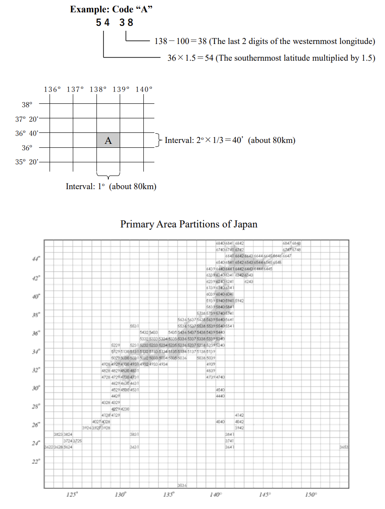

# The National Geographical Name Gazetteer Of Japan
[地名集 日本](https://www.gsi.go.jp/kihonjohochousa/gazetteer.html) is published by the Government of Japan, authored by the [Geospatial Information Authority of Japan](https://www.gsi.go.jp/top.html) and the Hydrographic and Oceanographic Departmenof Japan Coast Guard. The data published in this software bundle is the translated/normalized version of the information available in PDF on the national gazetteer.

## Preface
The National Geographical Name Gazetteer of Japan is published by the Government of Japan based on the resolution of the United Nations Conference on the Standardization of Geographical Names. It is prepared and regularly updated by the Geographical Survey Institute and the Hydrographic and Oceanographic Department of the Japan Coast Guard, the Government of Japan.

The Gazetteer is a comprehensive compilation of standardized geographical names of Japan including among others, administrative and residential areas, natural features, and ocean floor topography

The geographical names recorded here are those extracted from the 1:1,000,000-scale International Maps prepared by the Geospatial Information Authority of Japan as well as the 1:3,500,000-scale International Charts and 1:1,000,000-scale Bathymetric Charts prepared by the Hydrographic and Oceanographic Department of the Japan Coast Guard, and some of them have been updated for this new release. Moreover, the names of undersea features which had been approved at a session of the General Bathymetric Chart of the Oceans Sub-Committee on Undersea Feature Names organized jointly by the International Hydrographic Organization and the Intergovernmental Oceanographic Commission of UNESCO were added to this Gazetteer to form a collection of approximately 4,100 geographical names. The names of municipalities are those which have been given by local government agencies. In addition, most of the natural feature names have been standardized by the Joint Committee on the Standardization of Geographical Names, which was established jointly by the Geospatial Information Authority of Japan and the Hydrographic and Oceanographic Department of the Japan Coast Guard. 

## Explanatory notes

1. Every set of geographical name data consists of Grid Square Code, Japanese notations (in *kanji* and *kana* characters), Romanized notation, geographical coordinates (latitude and longitude), and classification.

2. The geographical names are listed in alphabetical order.

3. The Grid Square Code represents the Standard Grid Square (Primary Area Partition) based on Announcement No. 143 by the Administrative Management Agency (July 12, 1973). Each partition is equivalent to one sheet of the 1:200,000-scale regional map.

4. The Romanized notations are based on the *Hebon Shiki* (Hepburn system) alphabetization.

5. The Romanized notations for undersea feature names correspond to the proper noun terms of the geographical names registered at the General Bathymetric Chart of the Oceans Sub-Committee on Undersea Feature Names (SCUFN).

6. The geographical coordinates (latitude and longitude) are mainly based on the location of geographical names on the printed map. Those of rivers are associated with the positions of their estuary or lowermost stream point.

7. The classifications are sorted into municipalities, populated areas, mountains, passes, capes, rivers, lakes, sea areas, undersea features, islands, and extensive natural features.

8. The geographical names which appear in parentheses ( ) are alternate appellations.

9. The data for this Gazetteer are current as of March 2021.

## Standard Grid Square (Primary Area Partition)

The partition shows Japan divided into sections delineated by longitudinal lines and by even-numbered latitudes that are equally divided into 3 parts, which is equivalent to one sheet of the 1:200,000-scale regional map.

The Grid Square Codes are 4-digit numbers which are made by arranging, in the following order, the first 2-digit number derived by multiplying the southernmost latitude of the partition by 1.5, and the last 2-digit number derived by subtracting 100 from the westernmost longitude of the partition.

